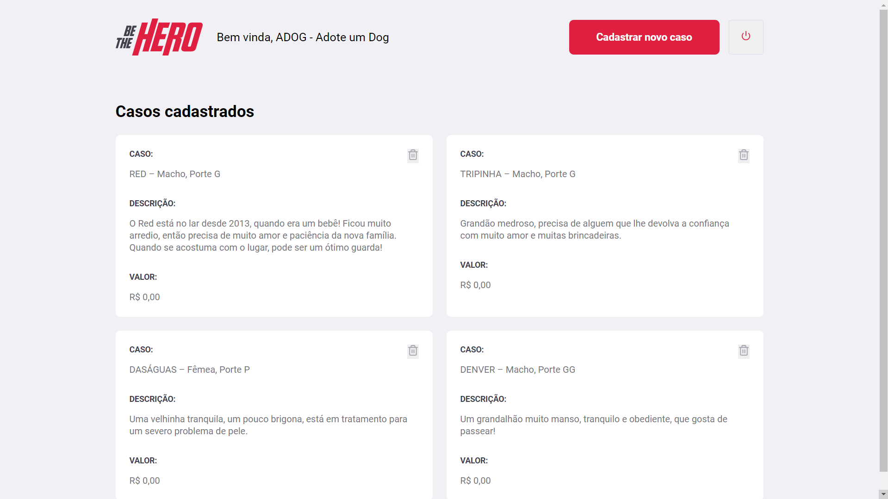
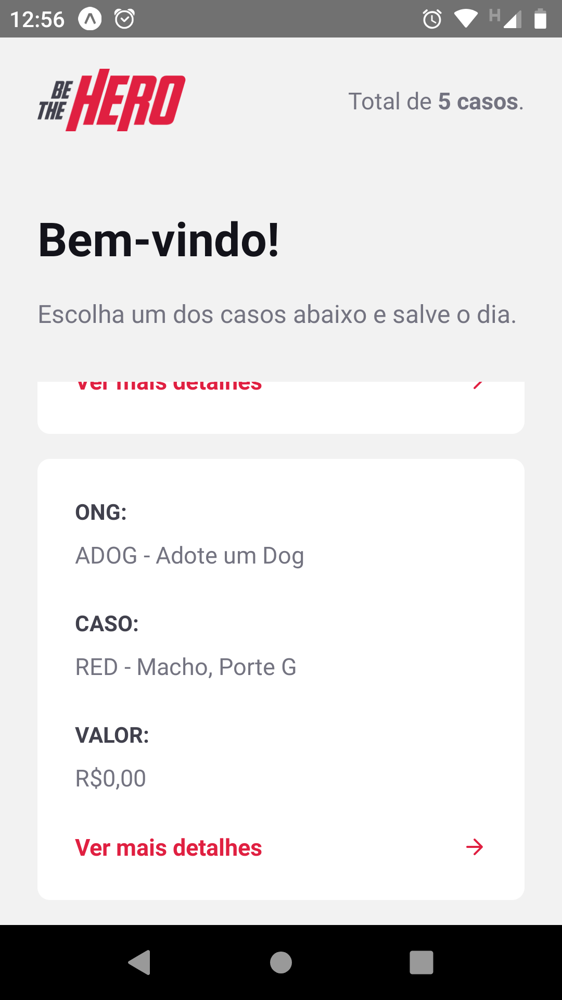
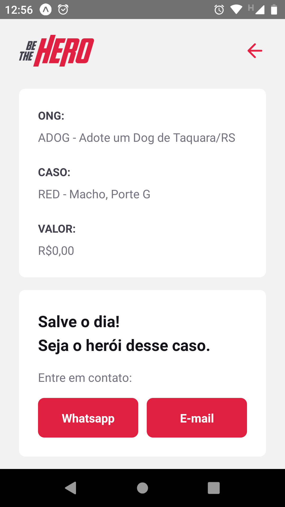

#

<h4 align="center">
  <br>
  <b>🦸‍♂️ É hora de se tornar um herói! 🦸</b>
</h4>

<p align="center">
  <a href="#-projeto">Projeto</a> |
  <a href="#-tecnologias">Tecnologias</a> |
  <a href="#-screenshots">Screenshots</a> |
  <a href="#-instalação">Instalação</a>   |
</p>

<br>

### 🚀 Projeto

Be The Hero é um projeto que tem como finalidade conectar ongs que precisam de ajuda com os nossos heróis do dia a dia.

Seja um herói, ajude o próximo.

### 👨‍💻 Tecnologias  

Be The Hero foi desenvolvido a partir das tecnologias:

* [NodeJS](https://nodejs.org/pt-br/)
* [ReactJS](https://reactjs.org)
* [React Native](https://facebook.github.io/react-native/)
* [Expo](https://expo.io/)
* [Express](https://expressjs.com/pt-br/)
* [Nodemon](https://www.npmjs.com/package/nodemon)
* [Axios](https://www.npmjs.com/package/axios)
* [Cors](https://www.npmjs.com/package/cors)
* [Eslint](https://www.npmjs.com/package/eslint)
* [Jest](https://www.npmjs.com/package/jest)

### 📸 Screenshots

#### 💻 Frontend

##### Tela de Login na Web


##### Tela de Cadastro na Web



#### 📱 Mobile

##### Tela Inicial do App

<br>

##### Tela de Contato com a Ong no App

<br>

### 💾 Instalação

Clone este repositório:

```bash
git clone https://github.com/Eliton-Dioni/be-the-hero.git
```

Entre na pasta do projeto:

```bash
cd be-the-hero/
```

### Backend

Para instalar todas as depêndencias do backend, execute o comando (yarn ou npm):

```bash
cd be-the-hero/backend
npm install
```

Para rodar o servidor NodeJS, dentro do diretório `backend`, execute o comando (yarn ou npm):

```bash
npm start
```

#### Frontend

Para instalar todas as depêndencias, execute o comando (yarn ou npm):

```bash
cd be-the-hero/frontend
npm install
```

Para rodar a aplicação ReactJS, dentro do diretório `frontend`, execute o comando (yarn ou npm):

```bash
npm start
```

A aplicação web iniciará automaticamente no seu navegador padrão.

#### Mobile

Para instalar todas as depêndencias, execute o comando (yarn ou npm):

```bash
cd be-the-hero/mobile
npm install
```

Para rodar a aplicação React Native, dentro do diretório `mobile`, com o [Expo](https://expo.io/) instalado, execute o comando (yarn ou npm):

```bash
npm start
```

ou

```bash
expo start
```

### ♻️ Contribuição

Sempre podemos nos aperfeiçoar, me ajude a criar um repositório cada vez melhor!

* Faça um fork desse repositório via Github;
* Crie uma branch com a sua feature: `git checkout -b my-feature-example`
* Faça commit das suas mudanças: `git commit -m 'feat: My new feature example'`
* Dê Push na sua branch: `git push origin my-feature-example`

### 📝 Licença

Esse projeto está sob a licença MIT. Veja o arquivo [LICENSE](./LICENSE.md) para mais detalhes.

Criado com ❤️ e ☕ por Eliton Dioni [LinkedIn](https://www.linkedin.com/in/eliton-dioni-9628a0104/)
<br>
Projeto desenvolvido na Semana Omnistack da [Rocketseat](https://rocketseat.com.br/) com certificação
